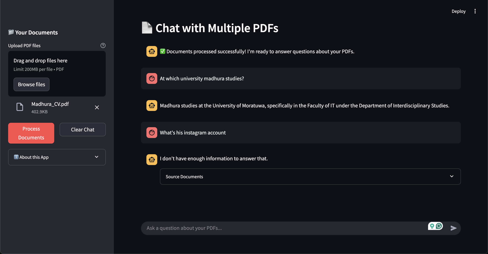

# Chat with Multiple PDFs





## 🔧 Technologies Used

- **Streamlit**: Frontend web interface
- **LangChain**: Framework for combining LLMs with external data
- **OpenAI**: GPT-3.5 Turbo for natural language understanding and generation
- **FAISS**: Vector database for efficient similarity search
- **PyPDF2**: PDF text extraction
- **Python**: Core programming language

## 🚀 Installation

1. Clone this repository:

   ```bash
   git clone <repository-url>
   cd RAG-Langchain-OpenAi
   ```

2. Create a virtual environment:

   ```bash
   python -m venv myenv
   ```

3. Activate the virtual environment:

   - On Windows:
     ```bash
     myenv\Scripts\activate
     ```
   - On macOS/Linux:
     ```bash
     source myenv/bin/activate
     ```

4. Install required packages:

   ```bash
   pip install -r requirements.txt
   ```

5. Set up environment variables:
   - Create a `.env` file in the project root
   - Add your API keys:
     ```
     OPENAI_API_KEY=your_openai_api_key
     ```

## 📋 Usage

1. Start the application:

   ```bash
   streamlit run app.py
   ```

2. Open your web browser and navigate to the URL shown in the terminal (typically http://localhost:8501)

3. Use the application:
   - Upload PDF files using the sidebar
   - Click "Process Documents" to analyze the content
   - Type your questions in the chat input
   - View the AI's responses and source references

## 💬 How It Works

1. **Document Processing**:

   - PDF files are uploaded and text is extracted
   - Text is split into manageable chunks
   - Chunks are embedded using OpenAI's embedding model
   - Embeddings are stored in a FAISS vector database

## OpenAI API Costs

The application primarily uses two OpenAI services that incur charges:

### 1. Text Embeddings

- **Model used**: `text-embedding-ada-002`
- **Cost**: $0.0001 per 1,000 tokens
- **Usage in application**: Used when processing PDFs to convert text chunks into embeddings

When you upload and process PDF documents, each chunk of text (default 1000 characters) is sent to OpenAI's embedding API. The cost depends on the total number of tokens in your documents.

**Approximate calculation**: A typical page of text contains about 500 words or roughly 3,000 characters. This translates to approximately 750 tokens.

| Document Size | Approximate Token Count | Approximate Cost |
| ------------- | ----------------------- | ---------------- |
| 10 pages      | 7,500 tokens            | $0.00075         |
| 100 pages     | 75,000 tokens           | $0.0075          |
| 1,000 pages   | 750,000 tokens          | $0.075           |

### 2. Chat Completion

- **Model used**: `gpt-3.5-turbo`
- **Cost**: $0.0015 per 1,000 input tokens and $0.002 per 1,000 output tokens
- **Usage in application**: Used when answering questions about the documents

Each time you ask a question, the application:

1. Sends your question plus relevant document context as input tokens
2. Receives the AI's answer as output tokens

**Approximate calculation per query**:

| Component           | Tokens (approx.)   | Cost                                  |
| ------------------- | ------------------ | ------------------------------------- |
| User question       | 20-50 tokens       | $0.00003-$0.00008 (input)             |
| Retrieved context   | 1,000-3,000 tokens | $0.0015-$0.0045 (input)               |
| AI response         | 100-500 tokens     | $0.0002-$0.001 (output)               |
| **Total per query** |                    | **$0.00173-$0.00558** (typical range) |

## Hugging Face Alternative (Optional)

If you switch to using the HuggingFace embeddings (uncomment the relevant line in the code), the embedding costs would be eliminated. However:

1. You would need more powerful hardware to run the embeddings locally
2. The embedding quality might differ from OpenAI's offerings
3. Initial load time for the embedding model would be longer

## Monthly Cost Estimates

Assuming regular usage:

| Usage Pattern | Document Processing | Queries per Month | Estimated Monthly Cost |
| ------------- | ------------------- | ----------------- | ---------------------- |
| Light         | 100 pages           | 50                | $0.30-$0.40            |
| Moderate      | 500 pages           | 200               | $1.00-$1.50            |
| Heavy         | 2,000 pages         | 1,000             | $5.00-$7.00            |

## Cost Optimization Tips

1. **Chunk size optimization**: Increasing the chunk size reduces the number of embeddings but might affect retrieval quality

2. **Token efficiency**: Be specific with your questions to reduce the number of tokens in both input and output

3. **Local models**: Consider implementing fully open-source alternatives like LlamaCPP for no API costs (will require code modifications)

4. **Caching**: The application implements caching mechanisms to avoid re-processing documents and re-generating answers to identical questions

## Monitoring Costs

1. Set up usage limits in your OpenAI account dashboard

2. Keep track of API usage through OpenAI's dashboard

3. Consider implementing additional logging to monitor token usage within the application

---

**Note**: Prices are subject to change. Always refer to [OpenAI's pricing page](https://openai.com/pricing) for the most up-to-date information.


## 🤝 Contributing

Contributions are welcome! Please feel free to submit a Pull Request.

